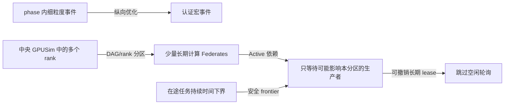

# 第二项工作：纵向事件聚合与横向并行协调

## 目标与二因素定义

第二项工作减少两类开销：单条计算时间线上的细粒度事件，以及多条 rank 时间线之间不必要的
同步。最终消融保留两个布尔变量：

| 变量 | 关闭 | 开启 | 直接作用 |
|---|---|---|---|
| 纵向优化 | 原始 phase 内计算事件 | Critical-path event acceleration，将认证闭区域收缩为宏事件 | 减少事件、派发和控制面处理 |
| 横向优化 | 所有 host 在一个 GPUSim Federate，静态保守协调 | 长期存活的 Federate 分区、Active-dependency 和安全 frontier | 暴露独立时间线并减少无关同步 |

横向优化是完整能力：Federate 切分提供并行单位，Active-dependency 表示当前依赖，frontier
证明 worker 在某个时间前不会收到新任务，长期 lease 消除短周期轮询。只开启 Active 而不切分，
或一 rank 一 JVM 而没有 frontier，都不能代表优化后的横向能力。

## 纵向实现

工作流通过 `acceleration.regions` 声明候选区域。优化器只收缩同一执行后端上的线性链，且
区域不能跨网络、collective、资源竞争或未声明状态边界。exact 区域要求持续时间等于成员
总和；approximate 区域携带显式上下界，并按关键路径误差预算选择性展开。

优化器先验证区域闭包和互斥性，再一次性建立 member-to-macro 映射并重写 DAG。该批量实现
避免逐区域复制整张图产生的二次级准备开销。

## 横向实现

### 长期 Federate 分区

实验脚本把多个 ranks 放入同一 GPUSim 进程。默认按连续 rank 分组，`--ranks-per-federate`
控制粒度；`--compute-partition-map` 可显式把 host 映射到分区，供多作业按独立 DAG 或连通分量
隔离。每个分区只有一个长期存活的 JVM 和 FNCS 连接。编排器根据 host-to-worker 映射定向派发，
并分别订阅每个 worker 的完成事件。

网络默认保留一条共享 ns-3 时间线，因为共享链路上的作业不是独立分区。只有不同作业的拓扑、
队列和链路资源均无交叉时，才能进一步拆分网络时间线；当前单作业消融不需要这一操作。

### Active-dependency

编排器根据当前在途计算 owner 和网络任务发布依赖图，更新携带单调 epoch。broker 把名称编译
成整数索引并缓存传递闭包，普通轮次复用时间状态和缓冲区。图无效、成环或尚未发布时，broker
回退到全局最小时间规则。

worker 在工作流结束前依赖编排器，编排器只依赖当前有在途工作的生产者。该关系保证稍后可能
接收后继任务的空闲 worker 不会越过派发时间。

### 安全 lower bound/frontier 与 lease

每次派发时，编排器记录该命令的最早可能完成时间：

- 计算事件使用 `dispatch time + duration lower bound - safety margin`；默认安全余量为 10,000 ns，
  覆盖 GPUSim/CloudSim 的浮点时间转换误差；
- 网络事件使用 `dispatch time + latency lower bound`，不把带宽序列化收益计入下界；
- 任一在途事件没有有效下界时，不发布 frontier。

所有在途证书的最小值形成输入 frontier。broker 只允许证书对应的 consumer 推进到 frontier，
并且不会在该 consumer 作为生产者时传播此值，从而避免错误放宽下游因果约束。事件完成后证书
立即删除；过期 frontier 也不会发布。

安全 frontier 模式下，worker 和编排器请求最大 FNCS 时间，形成可撤销长期 lease。Active
依赖仍会在最早生产者完成时唤醒编排器，所以最大请求不是无条件跳到仿真终点。该设计把原来的
1 ms 空闲轮询改成由真实事件和证书驱动的推进。

## 二因素消融矩阵

| 单元 | 纵向 | 横向 | 计算拓扑 | 时间协调 |
|---|---:|---:|---|---|
| 基线 | 关 | 关 | 1 个集中式 Federate | 全局保守 |
| 仅纵向 | 开 | 关 | 1 个集中式 Federate | 全局保守 |
| 仅横向 | 关 | 开 | 多 rank/长期 Federate | Active + frontier + lease |
| 组合 | 开 | 开 | 多 rank/长期 Federate | Active + frontier + lease |

横向开关同时改变进程拓扑和协调算法，符合完整能力的产品定义。若要分别归因切分、Active、
frontier 和 lease，需要固定其他条件再做机制级实验，不能从这张 2×2 表直接拆分贡献。

## 优化后消融结果

最终实现完成七个工作负载的 2×2 消融，每个单元三次，共 84 次端到端运行。除记录总墙钟外，
实验在编排器完成 FNCS 初始化和初始 dispatch 后写入 steady-start marker，并将 marker 之前
的启动段单独剥离。稳态墙钟只覆盖 marker 到仿真完成，因此不把 JVM/FNCS 进程启动计入稳态
加速比。由于 marker 位于编排器侧，它是可复现的初始化边界，不等同于所有 worker 同时到达
barrier；启动段定义和每次原始耗时都保存在 `summary.json` 与 `results.csv`。

| 工作负载 | 横向分区 | 仅纵向稳态 | 仅横向稳态 | 组合稳态 |
|---|---|---:|---:|---:|
| LULESH-64 | 2 Federates × 32 ranks | 3.166× | 1.004× | 3.165× |
| HPCG-8 | 2 Federates × 4 ranks | 1.362× | 1.037× | 1.521× |
| ICON-8 | 2 Federates × 4 ranks | 1.330× | 1.277× | 1.869× |
| HPCG-64 | 2 Federates × 32 ranks | 3.151× | 1.003× | 3.197× |
| ICON-64 | 2 Federates × 32 ranks | 3.024× | 1.016× | 3.112× |
| LAMMPS-64 | 2 Federates × 32 ranks | 2.932× | 1.013× | 3.030× |
| Grok-314B-256 | 8 Federates × 32 ranks | 2.760× | 1.464× | 12.066× |

横向收益可以近似写成“避免的调度轮次成本减去新增的依赖更新、跨进程通信和 JVM 成本”。
ICON-8 把轮次从 23,908 降到 4,753，下降 80.12%；每条新增控制记录对应消除 18.49 个轮次，
因此得到 1.277× 稳态加速。Grok-256 把 1,117,671 个轮次降到 115,613，下降 89.66%；每条
新增控制记录对应消除 292.40 个轮次，因此即使使用 8 个 Federate 仍得到 1.464× 横向加速。

HPCG-8 的轮次下降 46.02%，但基线稳态只有约 1.3 秒，第二个 JVM 和 993 次依赖更新占比很高，
最终只有 1.037×。四个 64-rank trace 每个 Federate 承载 32 ranks；频繁跨分区通信使两个
Federate 大部分时间仍互相依赖，轮次只下降 3.9%–7.1%，所以横向收益只有 1.003×–1.016×。
原始 GOAL 操作数不是可靠指标，因为转换后的 64-rank 工作负载均为 8,192 个计算事件；原始
操作主要改变事件持续时间和通信量，没有等比例增加可独立推进的控制事件。

明显横向收益需要稀疏的跨分区依赖、长安全推进窗口，以及足够长的稳态来摊薄进程固定成本。
后续应按通信图最小割或 DAG 社区划分 Federate，对通信密集型 trace 拆分网络时间线，并继续
合并 dependency epoch 与 grant/wakeup。完整定量分析见
`experiments/atlahs_ablation/SUITE_REPORT.md`。

为降低三个稳态控制开销，编排器在启动前预编译无变化的任务 dispatch 描述，并缓存 batch 的
schema/run-id JSON 前缀；运行时只编码序号、逻辑时间、microstep 和动态事件数组。依赖更新使用
1 ms 安全 frontier 量化，只向下收缩证书，不提前推进时间；broker 对单订阅直接转移原始消息，
避免重复复制；事件日志默认缓冲写入，避免逐条 flush。frontier 数值变化时现在使用
`frontier_only=1` 增量 epoch，只更新证书向量而不重建依赖闭包；拓扑变化或 frontier 撤销仍发送
完整原子更新。实验模式下 worker 的 CloudSim 诊断日志现在在进程内部直接关闭，而不是先构造
日志字符串再写入 `/dev/null`；开启诊断时原有日志行为不变。编排器事件日志复用已经编码的
JSON batch，避免对每个事件做第二次完整序列化。完成时间、重试、frontier 和失败状态仍在
运行时生成，因此没有削弱因果约束。
Active 模式下还实现了一个实验性的单 Federate 异步 grant fast path；它默认关闭，只有设置
`FNCS_ASYNCHRONOUS_GRANTS=yes` 才启用。启用时 broker 会在依赖闭包和 frontier 都能证明安全
时提前发放 grant，否则回退原来的全局保守 barrier。由于 frontier 与跨分区 dispatch 的交界
仍需要按工作负载验证，全量消融默认不启用该路径；`coordination.json` 仍记录
`asynchronous_grants` 供单独测试。跨多个 Federate 的批量 grant、长期 lease 和一 rank 一 JVM
仍是后续稳态优化方向。

随后在这版实现上对全部七个工作负载重新执行了完整 2×2 消融，每格三次，共 84 次端到端运行。
横向分区固定为 64 ranks 使用 2 个 Federate、8 ranks 使用 2 个 Federate、256 ranks 使用 8 个
Federate。横向单独的稳态加速分别为 LULESH-64 1.004×、HPCG-8 1.037×、ICON-8 1.277×、
HPCG-64 1.003×、ICON-64 1.016×、LAMMPS-64 1.013× 和 Grok-314B-256 1.464×；因此每个
工作负载都保持非负横向收益。组合稳态加速分别为 3.165×、1.521×、1.869×、3.197×、
3.112×、3.030× 和 12.066×。每个配置的三次总墙钟、启动段、稳态墙钟、均值、标准差和中位数
保存在 `experiments/atlahs_ablation/*_frontier_partitioned/results.csv`；总表见
`experiments/atlahs_ablation/workload_summary.csv`。所有配置的网络完成语义保持一致，makespan
跨度低于 10 ppm。

## 代码与验证

- 纵向优化器：`fncs/orchestrator/graph_optimizer.py`
- frontier、host 路由和依赖发布：`fncs/orchestrator/workflow_orchestrator.py`
- Active/frontier 调度器：`fncs/src/active_dependency_scheduler.hpp`
- 分区 worker 生命周期：`GPUsim/src/cloudsim/core/CloudSim.java`
- 二因素实验：`experiments/atlahs_ablation/run_ablation.py`
- Grok 最终报告：`experiments/atlahs_ablation/grok256_frontier_partitioned/REPORT.md`

验证包括 23 个 Python 编排器测试、C++ Active 调度测试、FNCS 完整构建、LULESH-8 冒烟、
分区扫描，以及七个正式工作负载共 84 次端到端运行。
