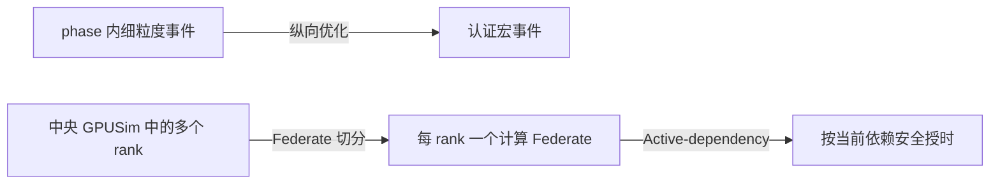

# 第二项工作：纵向事件聚合与横向并行协调

## 目标与二因素定义

第二项工作减少两类开销：单个计算时间线上的细粒度事件，以及多条 rank 时间线之间不必要的
全局同步。最终消融只保留两个布尔变量：

| 变量 | 关闭 | 开启 | 直接作用 |
|---|---|---|---|
| 纵向优化 | 原始 phase 内计算事件 | Critical-path event acceleration，将认证闭区域收缩为宏事件 | 减少事件、派发和控制面处理 |
| 横向优化 | 所有 host 放在一个 GPUSim Federate，静态保守协调 | 每 rank 一个 GPUSim Federate，并启用 Active-dependency | 暴露独立时间线，并按活动依赖授时 |

横向优化是一个组合能力。Federate 切分提供并行单位，Active-dependency 决定这些单位何时可
安全推进；只开启 Active 而不切分不能代表完整横向优化。

## 纵向实现

工作流通过 `acceleration.regions` 声明候选区域。优化器只收缩同一执行后端上的线性链，且
区域不能跨网络、collective、资源竞争或未声明状态边界。exact 区域要求持续时间等于成员
总和；approximate 区域携带显式上下界，并按关键路径误差预算选择性展开。

优化器先验证区域闭包和互斥性，再一次性建立 member-to-macro 映射并重写 DAG。该批量实现
避免逐区域复制整张图产生的二次级准备开销。

## 横向实现

实验脚本从 `hosts.json` 为每个 rank 生成独立 GPUSim 配置、输出目录和 FNCS ZPL。编排器读取
host-to-worker 映射，把 `compute.dispatch` 定向发布到对应 Federate，并分别订阅每个 worker
的 `compute.completed`。事件 ID 和 batch ID 包含 worker 名称，因此跨进程保持全局唯一。

分区 worker 在暂时没有本地任务时继续参与 FNCS 授时，等待后续跨 rank 或网络完成事件触发
的新任务；收到 `control.end` 且本地任务排空后才退出。这避免空闲 worker 提前离开 federation。

开启横向优化时，编排器按当前在途任务的 host 发布活动依赖图。依赖更新带单调 epoch；broker
把名称编译为整数索引并缓存传递闭包，普通轮次复用时间状态和缓冲区。为了防止一个空闲分区
越过未来派发时间，工作流结束前所有计算 worker 都保持对编排器的保守依赖。图无效或无法授权
时，broker 回退到全局最小时间规则。

## 消融矩阵

四个实验单元如下：

| 单元 | 纵向 | 横向 | 计算 Federates | Active-dependency |
|---|---:|---:|---:|---:|
| 基线 | 关 | 关 | 1 | 关 |
| 仅纵向 | 开 | 关 | 1 | 关 |
| 仅横向 | 关 | 开 | ranks | 开 |
| 组合 | 开 | 开 | ranks | 开 |

因此横向开关同时改变进程拓扑和协调算法。这符合“完整横向能力”的产品定义，也意味着结果包含
额外 JVM、FNCS 连接和序列化成本。若要分别归因切分和 Active，需要另做三因素实验。

## 实验结论

三个 HPC trace 和一个大模型训练 trace 均完成四组合、每组三次：

| 工作负载 | 仅纵向 | 仅横向 | 组合 | 横向调度轮次下降 |
|---|---:|---:|---:|---:|
| LULESH-64 | 2.421× | 0.551× | 1.138× | 3.77% |
| HPCG-8 | 1.280× | 0.736× | 1.056× | 2.62% |
| ICON-8 | 1.257× | 0.768× | 1.065× | 0.90% |
| Grok-314B-256 | 2.397× | 0.720× | 1.577× | 1.50% |

完整横向实现确实减少调度轮次，但当前“一 rank 一 JVM”的固定成本更大，因此四个数据集上
横向单独均未获得墙钟收益。纵向减少 87.5% 的计算派发后仍有明显收益；组合项在四个数据集
上都快于基线，但慢于仅纵向。此前 rank-local 纯协调实验得到的 2.153× 是排除 GPUSim、
ns-3 和进程成本后的协调层上界，不能替代这里的端到端结果。

## 正确性边界

四个工作负载的归一化网络完成语义哈希在四个单元中一致。模拟 makespan 最大相对跨度为：
LULESH 4.317 ppm、HPCG 0.998 ppm、ICON 0.489 ppm、Grok 0.028 ppm，均低于端到端分区实验
采用的 10 ppm 阈值。LULESH 超过旧的 1 ppm 阈值，因此文档保留实际偏差，不声明逐纳秒等价。

Active-dependency 当前根据在途 owner 发布依赖集合，尚未实现论文设想的逐边 lower-bound /
frontier 协议。当前结果证明组合能力可以运行并保持边界语义，不代表该协议已经完整实现。

## 代码与验证

- 纵向优化器：`fncs/orchestrator/graph_optimizer.py`
- host 路由与依赖发布：`fncs/orchestrator/workflow_orchestrator.py`
- Active 调度器：`fncs/src/active_dependency_scheduler.hpp`
- 分区 worker 生命周期：`GPUsim/src/cloudsim/core/CloudSim.java`
- 二因素实验：`experiments/atlahs_ablation/run_ablation.py`

本版本使用 FNCS `48dd83bd1`、GPUSim `6ab9fc71f`、ns-3 `2f049f0d4`。验证包含 20 个 Python
测试、Java 编译、LULESH-8 四象限冒烟实验，以及四个正式工作负载的 48 次端到端运行。
