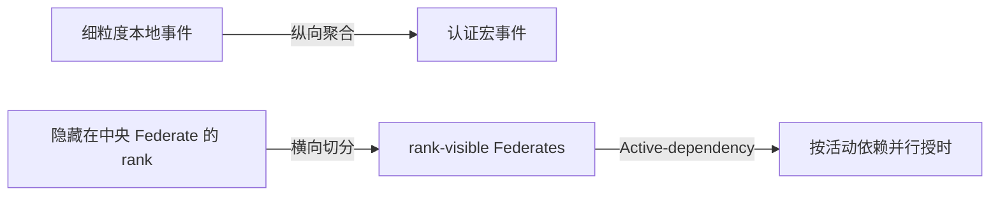

# 第二项工作：纵向事件聚合与横向时间协调

## 目标

第二项工作解决大规模协同仿真中两类独立开销：单个 Federate 内事件过多，以及多个
Federate 被全局保守时间同步串行化。最终设计保留两个优化轴：

| 优化轴 | 机制 | 直接减少的开销 |
|---|---|---|
| 纵向优化 | Critical-path event acceleration | Federate 内事件、任务派发和时间授权 |
| 横向优化 | rank-visible Federate 切分 + Active-dependency | 无关 Federate 之间的同步等待和 broker 调度轮次 |

事件聚合缩短一条时间线；Federate 切分暴露多条独立时间线；Active-dependency 根据当前
活动依赖并行推进这些时间线。切分是横向架构，Active-dependency 是横向协调算法。

## 纵向优化设计

工作流用 `acceleration.regions` 声明候选区域。只有同时满足以下条件的区域才能收缩：

- 成员构成同一执行后端上的线性链；
- 区域内部没有网络边或 collective 边界；
- causal、state、temporal 和 resource-non-interference 四类闭包均成立；
- exact 区域的持续时间与原任务总和一致；approximate 区域带有显式上下界。

优化器先验证所有区域互不重叠，再建立完整的 member-to-macro 映射，在一次图遍历中重写
边并生成宏任务。该批量收缩替代逐区域深拷贝整张 DAG 的实现，避免区域数增加时出现
二次级冷启动开销。近似区域依据关键路径上下界选择性展开，直到满足误差预算。

## 横向优化设计

每个可独立推进的 rank 或分区可以映射为一个 FNCS Federate。编排器在保留因果关系的前提
下发布当前活动依赖图；broker 仅让其活动生产者已经安全推进的 Federate 获得授权。

依赖更新采用单调递增 epoch。编排器只在三个状态之一变化时重建并发布依赖：计算任务在途、
网络任务在途、终止状态。broker 在收到新 epoch 时将名称转换为整数索引，并只计算一次传递
闭包；普通调度轮复用时间状态和 scratch buffers。缺少有效图、图异常或无法选择授权时，
broker 回退到原有全局最小时间规则。

编排器空闲时仍使用有限 lookahead。让空闲 Federate 直接请求终止时间会破坏动态派发：它
可能先到达终点，随后又收到由其他 worker 完成事件触发的新任务。

## 二因素实验定义

主消融采用固定的 rank-visible 切分，只改变两个布尔变量：

1. 纵向优化关闭/开启；
2. 横向 Active-dependency 协调关闭/开启。

固定切分可以保证四组具有相同的进程结构和工作负载。横向关闭表示使用全局保守协调，不是
把 rank 合并回中央进程。三 Federate 完整协同仿真作为端到端旁证，不与 rank-visible
协调上界直接比较墙钟时间。

## 实现结果

Grok-256 rank-visible 主消融中，纵向单开为 2.121×，横向单开为 2.153×，双开为
2.615×。纵向优化将计算事件从 32,768 降到 4,096；横向优化在事件未聚合时将调度轮次从
32,654 降到 129，双开后降到 17。

在包含 GPUSim、ns-3 和跨-rank 网络的三 Federate 完整模型中，纵向单开为 2.081×，
横向单开为 1.005×。这说明数据规模足以产生横向收益，但中央 GPUSim 隐藏了逐-rank
时间线。若要把横向收益带回完整模型，需要按 rank 或分区拆分 DAG 控制器，并为跨分区边
增加显式完成消息或安全时间 lease。

## 正确性边界

- 事件聚合不能跨越网络、collective、资源竞争或未声明状态边界。
- Active-dependency 只改变安全授权集合，不改变工作流事件或通信语义。
- Grok 完整模型四组均完成 4,758 个网络事件，归一化网络语义哈希相同。
- Grok 完整模型 makespan 最大差异为 7,820 ns，即 0.00777 ppm，低于 1 ppm 阈值。
- rank-visible 实验排除了跨-rank 网络和执行后端，只表示协调层性能上界。

## 代码与验证

- 纵向优化器：`fncs/orchestrator/graph_optimizer.py`
- 依赖发布：`fncs/orchestrator/workflow_orchestrator.py`
- 横向调度器：`fncs/src/active_dependency_scheduler.hpp`
- broker 集成：`fncs/src/broker.cpp`
- ATLAHS 端到端实验：`experiments/atlahs_ablation/run_ablation.py`
- rank-visible 扩展实验：`experiments/active_dependency_scaling/run_scaling.py`

验证覆盖 Python 编排器测试、C++ Active-dependency 调度器测试、小型控制面端到端测试，
以及 LULESH-64 和 Grok-256 的重复实验。完整结果索引见 `experiments/README.md`。
